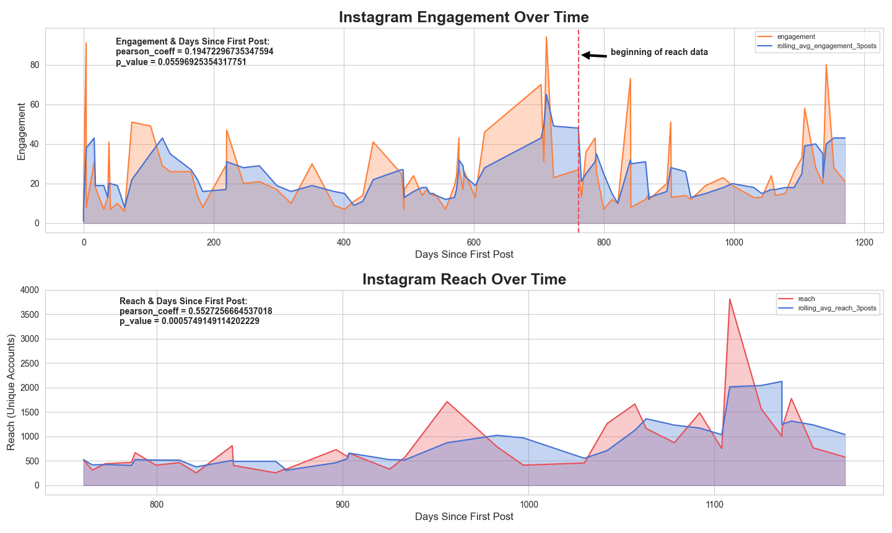
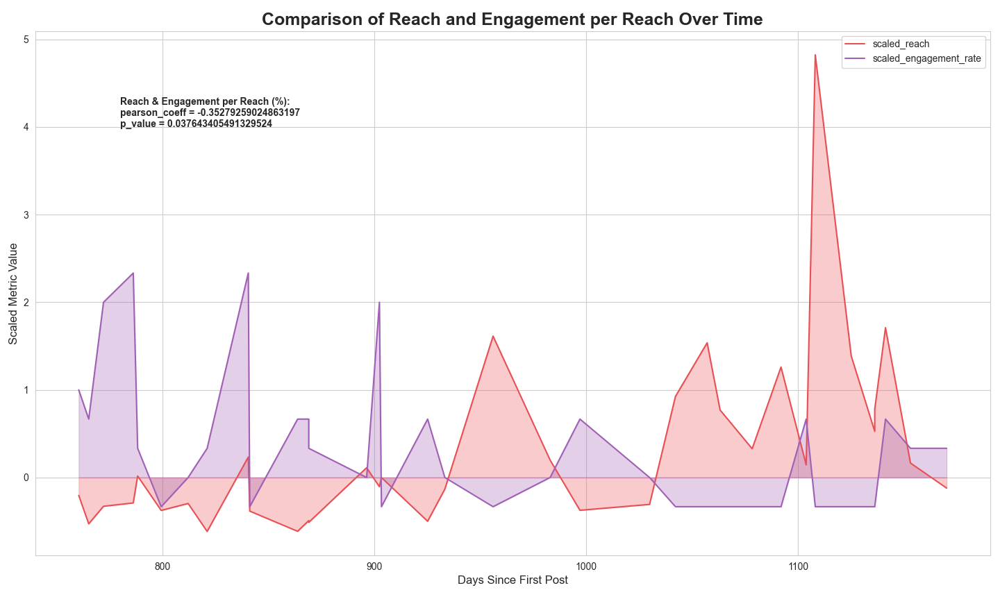
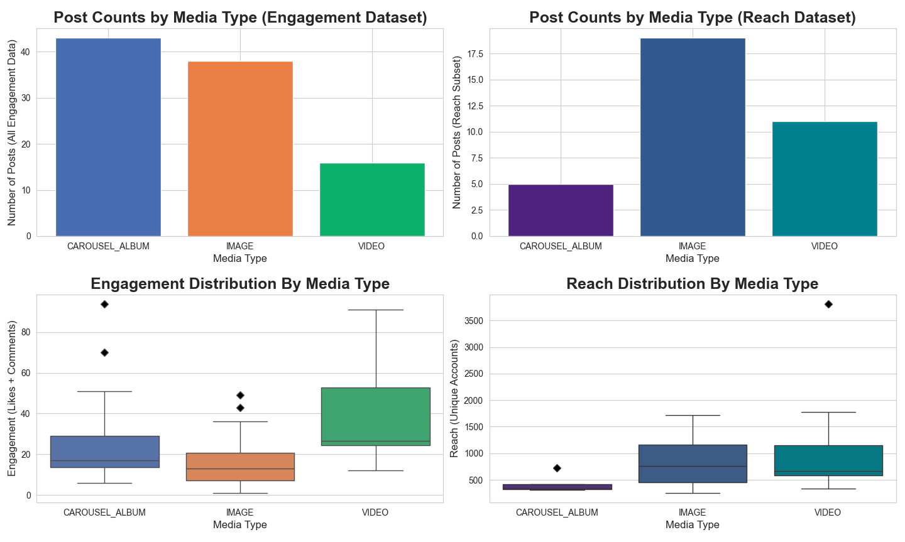
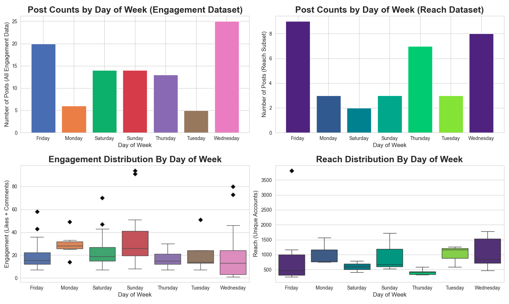
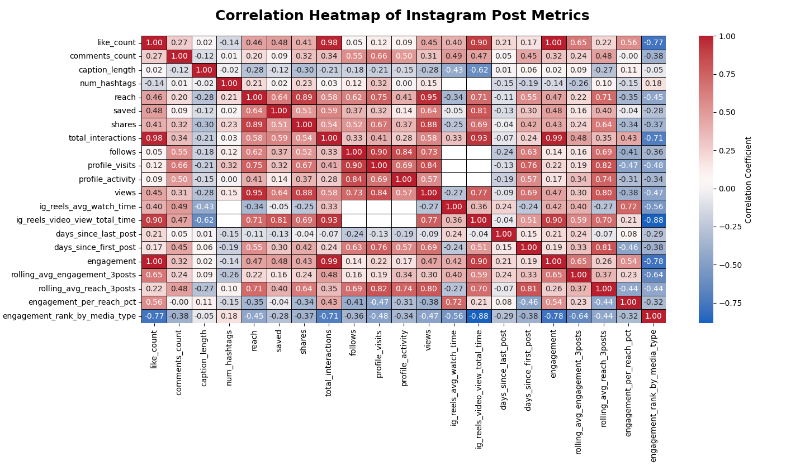
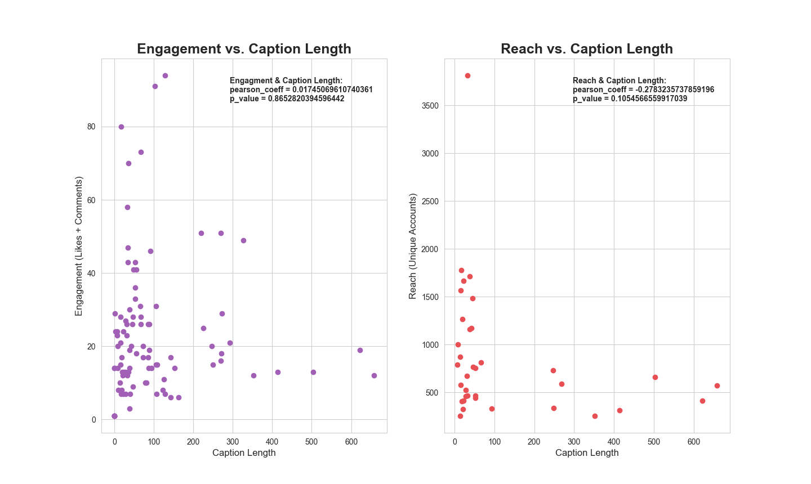
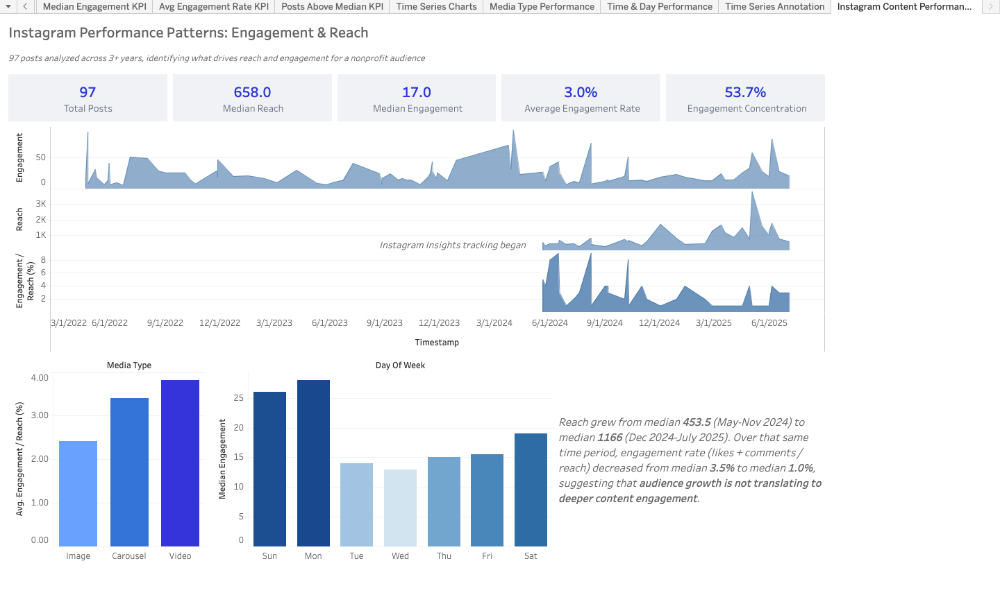

# 📸 Instagram Performance Patterns: Engagement & Reach Analysis

A full end-to-end data analytics project covering REST API data collection, SQL feature engineering, exploratory data analysis, and actionable content strategy recommendations — applied to a nonprofit organization's Instagram account spanning 3+ years of post history.

---

## 📋 Table of Contents

- [Project Overview](#project-overview)
- [Business Context & Impact](#business-context--impact)
- [Tech Stack](#tech-stack)
- [Project Architecture](#project-architecture)
- [Key Metrics & Findings](#key-metrics--findings)
- [Performance Trends](#performance-trends)
- [Content Strategy Insights](#content-strategy-insights)
- [Visualizations](#visualizations)
- [Limitations & Future Work](#limitations--future-work)
- [Repository Structure](#repository-structure)

---

## Project Overview

This project collects, processes, and analyzes Instagram post performance data for a nonprofit organization via the Instagram Graph API, with the goal of identifying what content and publishing patterns drive audience engagement and reach. The pipeline ingests raw JSON responses into a local SQLite database, engineers a rich set of post-level features using a multi-step SQL CTE view, and delivers findings through exploratory analysis and an interactive Tableau dashboard.

The project is structured as three sequential notebooks plus a companion Excel workbook (`InstagramPostMetricsInsights.xlsx`) and a Tableau dashboard (`InstagramContentPerformanceOverview.png`):

| Notebook | Description |
|---|---|
| `01_data_collection_and_cleaning` | Instagram Graph API ingestion via OOP pipeline, SQLite storage, SQL view with feature engineering |
| `02_exploring_performance_patterns` | Time-series analysis, correlation testing, media type and day-of-week breakdowns, 9 EDA visualizations |
| `03_insights_recommendations_and_limitations` | Business-facing summary of findings, actionable recommendations, and analytical limitations |

---

## Business Context & Impact

Nonprofit social media teams operate with limited bandwidth and need to make every post count. This project gives the content team a data-driven foundation for those decisions:

- **Establishes a performance baseline** — median reach of 658 and median engagement of 17 across 97 posts, with an average engagement rate of 3.0% and 53.7% engagement concentration in top-performing posts
- **Surfaces a critical growth-engagement gap** — reach grew from a median of 453.5 (May–Nov 2024) to 1,166 (Dec 2024–Jul 2025), while engagement rate fell from 3.5% to 1.0% over the same period, signaling that audience growth is not translating to deeper content engagement
- **Identifies highest-performing content format** — VIDEO posts generate higher average engagement than IMAGE or CAROUSEL_ALBUM content, with an average engagement/reach rate of ~4.0% vs. ~2.6% for images
- **Confirms optimal publishing windows** — posts on Sunday and Monday (aligning with Saturday–Sunday for the U.S.-based audience) generate meaningfully higher median engagement than mid-week posts
- **Challenges common assumptions** — caption length showed no significant relationship with engagement and only a weak (non-significant) negative correlation with reach, suggesting time invested in long captions may not pay off for this account
- **Findings actively inform content decisions** — the social media team adopted the project's recommendations into their content planning workflow

---

## Tech Stack

| Category | Tools |
|---|---|
| **Data Collection** | Python, `requests`, Instagram Graph API (v22.0) |
| **Storage** | SQLite, SQL Magic (`%sql`) |
| **Data Processing** | `pandas`, `numpy` |
| **Feature Engineering** | Raw SQL (CTEs, `LAG`, `FIRST_VALUE`, `RANK`, rolling `AVG`, `PARTITION BY`) |
| **EDA & Visualization** | `matplotlib`, `seaborn` |
| **Statistics** | `scipy.stats` — Pearson correlation, p-value testing |
| **Reporting** | Tableau (dashboard), Excel (post metrics workbook) |

---

## Project Architecture

```
Instagram Graph API (v22.0)
        │
        ▼
InstaCollector (src/insta_collector_loader.py)
  ├── get_fields()         # Paginated post metadata collection (caption, likes, comments, etc.)
  ├── get_insights()       # Per-post metrics (reach, saves, shares, views, watch time)
  └── db_initializer()     # SQLite ingestion → kgc_json, kgc_account tables
        │
        ▼
InstaLoader (src/insta_collector_loader.py)
  ├── fields_loader()      # JSON string → Python dict
  └── insights_loader()    # Flattened insights → structured DataFrame → SQLite 'insights' table
        │
        ▼
SQL View: ig_post_metrics (sql/data_cleaning_feature_engineering.sql)
  ├── posts CTE                     # JSON extraction: media_type, like_count, caption_length, num_hashtags
  ├── posts_with_insights CTE       # LEFT JOIN posts × insights on post_id
  ├── post_time_features CTE        # LAG() days_since_last_post, FIRST_VALUE() days_since_first_post,
  │                                 #   STRFTIME() → day_of_week, time_of_day
  └── post_engagement_metrics CTE   # engagement (likes + comments), engagement_per_reach_pct,
                                    #   rolling_avg_engagement_3posts (ROWS BETWEEN 2 PRECEDING),
                                    #   engagement_rank_by_media_type (RANK + PARTITION BY)
        │
        ├──► reports/InstagramPostMetricsInsights.xlsx
        │       └── Full post-level metrics export with engagement and reach fields
        │
        ├──► dashboards/InstagramContentPerformanceOverview.png
        │       └── Tableau dashboard: time-series, media type, day-of-week, reach/engagement KPIs
        │
        ▼
EDA → notebooks/02_exploring_performance_patterns.ipynb
```

---

## Key Metrics & Findings

### Account-Level Performance Summary

| Metric | Value |
|---|---|
| Total posts analyzed | 97 |
| Posts with advanced metrics (reach, views, etc.) | ~35 |
| Median reach | 658 |
| Median engagement (likes + comments) | 17 |
| Average engagement rate | 3.0% |
| Engagement concentration (top posts) | 53.7% |
| Data span | March 2022 – July 2025 (3+ years) |

### Feature Relationships with Engagement & Reach

| Feature | Engagement | Reach | Notes |
|---|---|---|---|
| `caption_length` | No significant relationship | Moderate negative correlation (not statistically significant) | Cannot reject null hypothesis |
| `days_since_last_post` | No significant relationship | No significant relationship | Posting cadence not a meaningful driver |
| `num_hashtags` | Appears positively linked | Appears positively linked | Very small sample; warrants further testing |
| `media_type` (VIDEO) | Higher avg engagement | No significant difference vs. IMAGE | VIDEO outperforms on engagement rate |
| `day_of_week` (Sun/Mon) | Higher median engagement | No significant difference | U.S. weekend alignment effect |
| `time_of_day` | No meaningful impact | No meaningful impact | Time of posting not a reliable lever |

---

## Performance Trends

### Reach vs. Engagement Rate Over Time

The account's reach has grown substantially — rising from a median of **453.5** (May–Nov 2024) to **1,166** (Dec 2024–Jul 2025), reflecting meaningful growth in post exposure. However, over that same period, the median engagement rate (likes + comments / reach) declined from **3.5% to 1.0%**, indicating that newer audiences are engaging at significantly lower rates than the account's original follower base.

This divergence between reach and engagement rate is the central finding of the project and points to a content-audience fit challenge: the account is growing its distribution, but not deepening its connection with newer followers.

### Engagement Concentration

53.7% of total engagement is concentrated in the top-performing posts, suggesting a high-variance content environment where a small number of posts drive the majority of audience interaction. This makes identifying and replicating top-post characteristics a high-leverage opportunity for the content team.

---

## Content Strategy Insights

### 1. Prioritize VIDEO Content
VIDEO posts achieve the highest average engagement/reach rate (~4.0%), outperforming both IMAGE (~2.6%) and CAROUSEL_ALBUM formats. Reels-specific metrics (avg watch time, total view time) provide additional levers for evaluating video performance beyond likes and comments.

### 2. Publish on Sunday and Monday
Posts published on Sunday and Monday — which correspond to Saturday and Sunday for the U.S.-based audience — generate the highest median engagement across all days of the week. Mid-week posts (Tuesday through Thursday) consistently underperform.

### 3. Shorten Captions, Especially on Reels
While not statistically conclusive, the negative trend between caption length and reach suggests that longer captions may reduce viewing time on VIDEO posts, leading to lower algorithmic amplification. Concise captions are recommended as a testable improvement.

### 4. Increase Hashtag Usage
Despite a very small sample, hashtag usage appears linked to both higher engagement and higher reach. The team should experiment with broader and more diverse hashtag sets and track performance against hashtag-free posts.

### 5. Boost Top-Performing Posts
The top 3 posts by engagement in each media type category are prime candidates for Instagram's paid Boost feature to expand reach and reinforce high-performing content signals with the algorithm.

---

## Visualizations

### Engagement & Reach Over Time

> Time-series view of engagement and reach from March 2022 through July 2025. Reach shows a clear upward trend beginning in mid-2024; engagement remains flat, producing a widening gap between audience size and content interaction.

---

### Reach & Engagement Rate Trend

> Annotated trend chart showing the median reach increase (453.5 → 1,166) alongside the engagement rate decline (3.5% → 1.0%) across the same period. The divergence is the clearest evidence of the growth-engagement gap.

---

### Media Type Performance

> Comparison of average engagement/reach rate across IMAGE, CAROUSEL_ALBUM, and VIDEO post types. VIDEO outperforms both other formats; CAROUSEL_ALBUM's apparent underperformance is likely a sample size artifact.

---

### Day of Week Analysis

> Median engagement by day of week. Sunday and Monday — corresponding to peak U.S. follower activity on weekends — produce the highest engagement, while Tuesday through Thursday consistently underperform.

---

### Correlation Heatmap

> Pearson correlation matrix across quantitative features. Engagement and reach show limited correlation with caption length and days since last post, confirming that neither posting frequency nor caption volume is a reliable performance driver.

---

### Caption Length vs. Engagement & Reach

> Scatter plots of caption_length against engagement and reach. The weak negative trend with reach is visible but falls short of statistical significance (p > 0.05).

---

### Tableau Dashboard

> Interactive overview dashboard combining KPI cards, time-series panels, and media type / day-of-week bar charts into a single executive-facing view. Delivered to content leadership alongside written recommendations.

---

## Limitations & Future Work

**Current limitations:**

- **Small dataset with partial advanced metrics** — the full dataset covers ~97 posts, but only ~35 include advanced insights (reach, views, watch time) due to the account's conversion to creator type partway through the analysis period. Most statistical findings should be treated as indicative rather than definitive
- **Single-account scope** — findings reflect one nonprofit Instagram account and may not generalize to accounts with different audience profiles, posting frequencies, or content mixes
- **Unobserved variables** — visual quality, caption sentiment, audience demographics, and algorithmic context are not captured in the Graph API data and likely explain a substantial share of performance variance
- **Algorithmic opacity** — Instagram's content distribution algorithm is complex and frequently updated; observed performance patterns may shift as the algorithm evolves

**Planned improvements:**

- Expand the dataset over time as more posts with full advanced metrics accumulate, enabling more robust statistical testing
- Apply NLP techniques (sentiment analysis, topic modeling) to caption text to explore whether content tone or subject matter predicts performance
- Build a lightweight regression model to predict engagement or reach from available post-level features, with cross-validation to test generalizability
- Incorporate audience demographic data (age, location, gender) from the Graph API to contextualize the engagement rate decline relative to follower composition

---

## Repository Structure

```
instagram-performance-analysis/
├── dashboards/
│   ├── InstagramContentPerformanceOverview.png   # Tableau dashboard export
│   └── README.md
├── data/
│   ├── processed/
│   │   └── ig_post_metrics.csv                   # Cleaned dataset (SQL view export)
│   └── README.md
├── figures/
│   ├── performance_analysis/
│   │   ├── corr_heatmap.png
│   │   ├── day_of_week_plots.png
│   │   ├── eng_reach_caption_length.png
│   │   ├── eng_reach_days_since_last.png
│   │   ├── engagement_reach_time.png
│   │   ├── media_type_plots.png
│   │   ├── reach_eng_rate_trend.png
│   │   ├── reach_engagement_rate_box.png
│   │   └── time_of_day_plots.png
│   └── README.md
├── notebooks/
│   ├── 01_data_collection_and_cleaning.ipynb
│   ├── 02_exploring_performance_patterns.ipynb
│   └── 03_insights_recommendations_and_limitations.ipynb
├── reports/
│   └── InstagramPostMetricsInsights.xlsx         # Full post-level metrics workbook
├── sql/
│   └── data_cleaning_feature_engineering.sql     # Multi-CTE SQL view definition
├── src/
│   └── insta_collector_loader.py                 # InstaCollector & InstaLoader classes
└── README.md
```

---

*Data sourced from the Instagram Graph API (v22.0). All analysis performed on posts published by a nonprofit Instagram business account from March 2022 through July 2025.*
